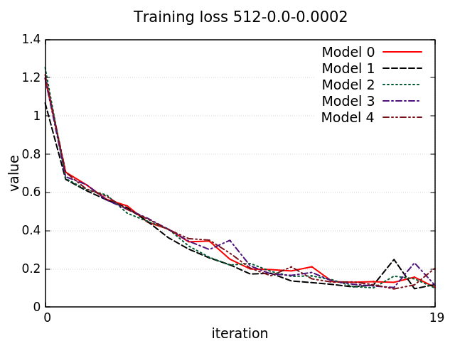
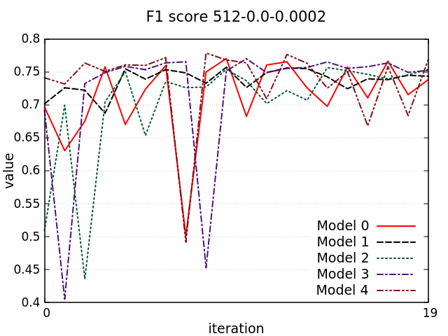
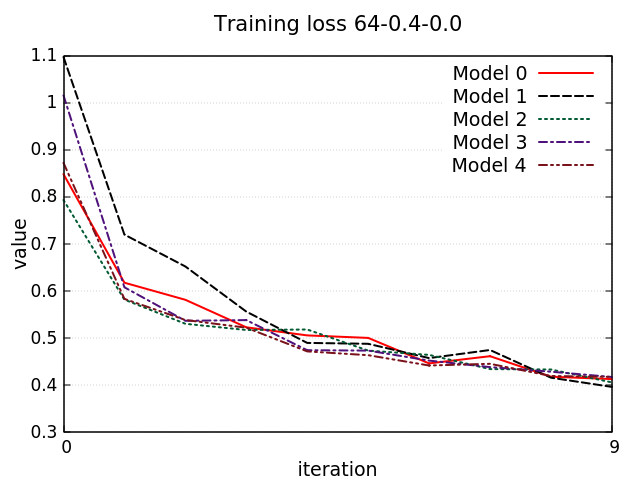
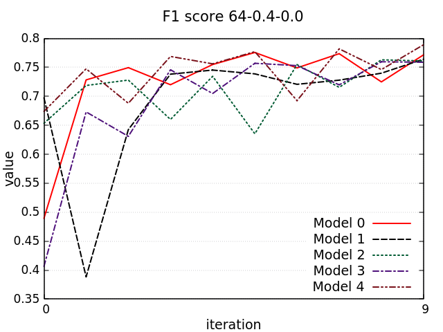
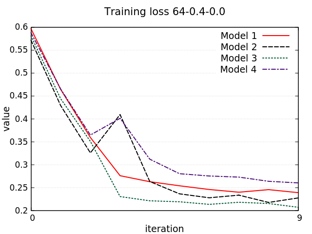
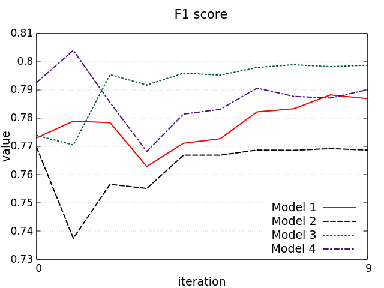

# Hate Speech Detection

The purpose of this project was to build an Hate Speech Detector that given a tweet is able to recognize, if it contains hateful content or not. The dataset used to build the model was obtained from [Evalita-2020](http://www.evalita.it/2020), a challenge to evaluate the NLP and Speech tools for the Italian language, more in details on the [haspeede2](http://www.di.unito.it/~tutreeb/haspeede-evalita20/index.html) task. More information about the project can be found in the [report](https://github.com/GiovanniSorice/Hate_Speech_Detection/blob/main/docs/Report_Human.pdf).

## Models 
We analyzed and trained three machine learning models, the first one is the [bidirectional LSTM](https://paperswithcode.com/method/bilstm), the second one is the [Kim Convolutional neural network](https://arxiv.org/pdf/1408.5882.pdf) and the last one based on [BERT](https://arxiv.org/pdf/1810.04805.pdf) model is [AlBERTo](http://ceur-ws.org/Vol-2481/paper57.pdf). In order to evaluate the machine learning models in a better way we perform a k-Fold Cross-Validation (where k equal to five). 

## Running the project
All the models have a [notebook](https://github.com/GiovanniSorice/Hate_Speech_Detection/tree/main/notebooks) that can be runned on Google Colab, to speed up the computation required for the training and inference phase it is suggested to change the runtime type to GPU. 

## Results 
The learning and the f1 score plots obtained during the training of the models are shown below. 

 

 

 

## Acknowledgments
This project was developed for the course of [Human Language Technologies](https://elearning.di.unipi.it/course/view.php?id=180) at the University of Pisa under the guide of [Prof. Giuseppe Attardi](http://pages.di.unipi.it/attardi/).

## Authors 
* **Giovanni Sorice**  - [Giovanni Sorice](https://github.com/GiovanniSorice)
* **Francesco Corti**  - [FraCorti](https://github.com/FraCorti)